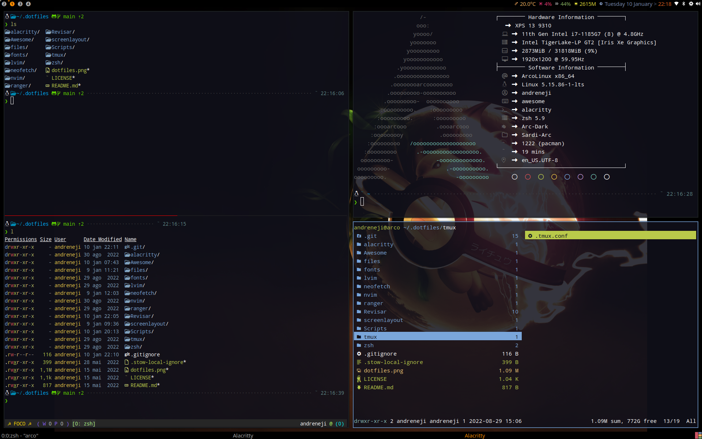

# Dotfiles



## Installing

You will need [git](https://git-scm.com/downloads) and GNU [stow](https://www.gnu.org/software/stow/manual/stow.html)

Clone into your `$HOME` directory or `~`

```bash
git clone https://github.com/andreneji/.dotfiles.git
```

Run `stow` to symlink everything:

```bash
stow */ # Everything (the '/' ignores the README)
```

or just select what you want:

```bash
stow zsh 
stow ranger
stow lvim
...
...
...
```

## References

- [Fabio Akita - O Melhor Setup Dev com Arch e WSL2](https://www.youtube.com/watch?v=sjrW74Hx5Po)
- [Machfiles](https://github.com/Mach-OS/Machfiles)
- [Lazygit](https://github.com/jesseduffield/lazygit)
- [Ranger](https://github.com/ranger/ranger)
  - [Ranger_devicons](https://github.com/alexanderjeurissen/ranger_devicons) 
